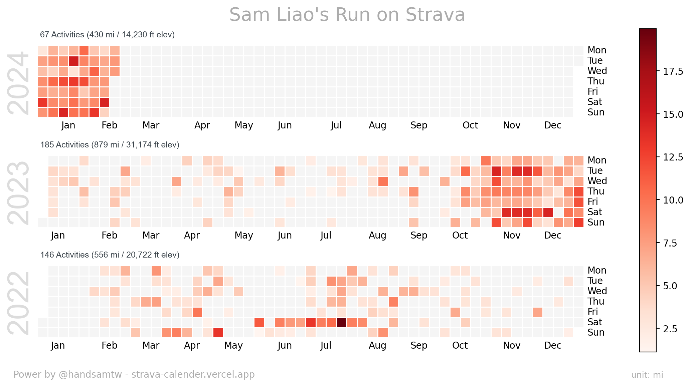

### Hello visitor 👋  

🌃 I’m a Taiwanese Software Developer currently living at New York   
👨‍💻 Graduated from CMU MISM, Pittsburgh   
🔥 I am passionate about Running, Cycling, and Chess    

#### Tech Stack 🧪   
<!-- icon: https://github.com/tandpfun/skill-icons#readme -->

<h5>⚡ Web dev </h5> 

<h5>⚡ Languages </h5> 

<h5>⚡ Others </h5> 

---

### GitHub Stats

### Most recently played Song

  

### My running journey on Strava

## Reach me via

	
	

